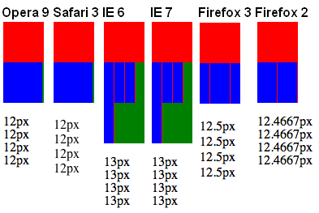

###### Front-End Develop SCHOOL

# DAY 21

### 모바일 최적화

- `handheldfriendly`, `mobileoptimized` 속성 값은 오래된 모바일 기기 화면에 최적활 할 때 사용. (스마트 폰 환경에서는 불 필요)
- `viewport` 속성 값은 스마트 폰 화면에 최적화할 때 사용.
    - `width=device-width` 설정은 기기(Device)의 화면 가로 폭에 최적화된 뷰를 제공.
    - `initial-scale=1` 설정은 기본 화면 비율 크기를 배율 x1로 설정.

```html
<meta name="handheldfriendly" content="true">
<meta name="mobileoptimized" content="240">
<meta name="viewport" content="width=device-width,initial-scale=1">
```

> ※ 최신 iOS 버전의 사파리에서는 화면에 맞게 수축(Shrink)하는 설정 여부가 추가됨.<br> &nbsp;&nbsp;
`shrink-to-fit=no` 설정은 화면 크기에 맞게 화면 요소들이 축소되는 것을 방지함.

```html
<meta name="viewport" content="width=device-width, initial-scale=1, shrink-to-fit=no">
```

-

### [참고: CSS Device Adapt](https://drafts.csswg.org/css-device-adapt/#translate-meta-to-at-viewport)

`@viewport` 규칙은 `<meta name="viewport">` 코드(비표준)를 대체하는 표준이 될 코드이지만, 모든 웹 브라우저가 지원하는 것은 아님.

```css
@-webkit-viewport { width: device-width; zoom: 1; }
@-moz-viewport    { width: device-width; zoom: 1; }
@-ms-viewport     { width: device-width; zoom: 1; }
@-o-viewport      { width: device-width; zoom: 1; }
@viewport         { width: device-width; zoom: 1; }
```

위 `@viewport` 규칙은 아래 `<meta name="viewport">` 코드와 동일한 역할을 수행.

```html
<meta name="viewport" content="width=device-width, initial-scale=1">
```

-

### 기타 설정

- `box-sizing: border-box;` 설정은 `width`, `height` 영역을 `border`영역까지 확대시켜 디자인을 용이하게 설정.
- `text-size-adjust: 100%;` 작은 화면(모바일)에 웹 사이트를 최적화하하는 과정에서 텍스트 크기를 임의로 변경(팽창)하지 않도록 설정.

```css
html {
    /* 박스 크기 설정 */
    box-sizing: border-box;
    /* 텍스트 크기 조정 설정 */
    -moz-text-size-adjust: 100%;
    -ms-text-size-adjust: 100%;
    -webkit-text-size-adjust: 100%;
    text-size-adjust: 100%;
}

*, *::before, *::after {
    /* 박스 크기 설정 상속 */
    box-sizing: inherit;
}
```

-

#### 브라우저 일반화

웹 브라우저마다 기본 스타일 설정이 달라 이를 일반화(Normalization)할 필요가 있음.

[Normalize.css](http://necolas.github.io/normalize.css/)

#### [CSS 공통 모듈 생성기](http://url.yamoo9.net/common)

프로젝트에 사용될 공통 스타일 모듈을 손쉽게 생성할 수 있는 도구(using Sass)

---

### Sub Pixel Problems In CSS

아래와 같이 50px 너비를 가진 div에 4개의 `<div>` 요소에 float을 설정했을 때
흥미로운 결과가 브라우져 별로 다르게 나온다는 것을 발견하고 그것에 대해서 얘기를 하고 있습니다.

```css
float: left;
width: 25%;
```



```css
.container {
  width: 50px;
  height: 50px;
  background: red;
}

.demo {
  background: green;
}

.test {
  float: left;
  width: 25%;
  height: 50px;
  background: red;
  font-size: 10px;
  font-family: Arial;
  color: black;
}

.inner {
  float: left;
  width: 12px;
  height: 50px;
  background: blue;
}
```

```html
<div class="container"></div>
<div class="container demo">
    <div class="test"><div class="inner"></div></div>
    <div class="test"><div class="inner"></div></div>
    <div class="test"><div class="inner"></div></div>
    <div class="test"><div class="inner"></div></div>
</div>
```

##### 1. Opera 9, Safari 3
전체 50px에서 48px만 채우는 것을 볼 수 있다. 오른쪽을 보면 2px(초록색으로 표시된부분)이
부족한 걸 알 수 있다.<br>네비게이션 작업 할 때 이렇게 작업할 경우 다 채우지 못하는 걸 알아야 한다.

##### 2. IE 6,7
**IE의 경우는 2px이 넘치는 경우가 발생**하고 위와 같이 레이아웃이 깨지는 것을 볼 수 있다.

##### 3. FF 2, FF 3
FF의 경우는 각 `<div>`가 12px과 13px의 사이의 값을 보여주고 있다.

-

다음의 경우를 모질라 개발자들과 David Baron은 아래와 같이 설명하고 있다.

- 인접한 엘리멘트가(너비가 25%인) 박스의 시작부터 끝까지 정확하게 끝이 나야 하고 확장 또는 넓어지는 px 값은 생기면 안된다.
- 엘리멘트 들은 항상 논리적으로 맞닿아야 하고, 라운딩 에러 때문에 픽셀이 넘치거나 적은 문제가 일어나면 안된다.
- 똑같은 너비를 가진 엘리멘트 들은 똑같은 너비를 가지고 있어야 한다.
- 엘리멘트의 외곽 부분은 불 명확하지 않고 명확한 외곽라인을 가지고 있어야 한다.

특이하게도 위와 같은 내용이라면 정확히 맞아야 하지만 그렇지 못하다.이것은 렌더링 엔진이 CSS지원을
제대로 하지 못하고 있고 이것을 해결하는 방법에 대해 정확히 말할 순 없지만 업무를 할때
이것에 대해 알고 해야 할 것 같다.

-

- [Sub Pixel Problems In CSS](http://ejohn.org/blog/sub-pixel-problems-in-css/)
- [Fluid Grid Rounding Errors](http://johnalbin.github.io/fluid-grid-rounding-errors/)

---

### Isolate Float 테크닉

#### 테크닉 원리

__isolate 테크닉에 요구되는 사항__<br>
※ 테크닉 사용시 혼란이 올 수 있으니, 음수 마진 값 설정에 대한 이해가 요구됨.

- 개별 레이아웃 요소는 `margin-left` 값을 통해 정확한 위치를 설정.
- 개별 레이아웃 요소는 `margin-right: -100%;`를 사용하여 뒤에 오는 요소를 끌어(pull) 당긴다.

-

###### STEP 1

__3 컬럼 레이아웃__을 디자인한다고 가정.


-

###### STEP 2

아이템1에 `margin-left: 0;`을 설정하여 왼쪽 끝 시작 점에 맞춤. 이어서 `margin-right: -100%;` 값을 설정하여 아이템2를 시작점으로 끌어옴.


-

###### STEP 3

아이템2 요소에 `margin-left` 속성 값을 퍼센트(%)로 설정하여 3번째 컬럼의 위치( 컬럼x2 + 거터x2 )로 이동시킴.


이어서 아이템2 요소에 `margin-right: -100%`를 설정하여 아이템3 요소를 끌어 당김.


그러면 아이템3 요소는 시작점으로 이동하게 됨.


-

###### STEP 4

아이템3 요소에 `margin-left` 속성 값을 퍼센트(%)로 설정하여 5번째 컬럼의 위치( 컬럼x4 + 거터x4 )로 이동시킴.


※ 이와 같은 패턴으로 각각의 레이아웃 요소에 정확한 레이아웃을 설정하면 Sub Pixel 문제에서 벗어날 수 있음. 이와 같은 레이아웃 방법을 Isolate 레이아웃이라고 함.

-

###### STEP 5

만약 아이템3 요소를 다음 행(Row)의 시작점에 위치하여 레이아웃을 설정하고자 한다면, 먼저 `clear: left` 속성을 설정하여 Clear 영향권에서 벗어남.


그리고 `margin-left: 0`을 설정하여 시작점으로 이동시킴.


-

#### 참고

[Responsive Design’s Dirty Little Secret](https://www.palantir.net/blog/responsive-design-s-dirty-little-secret)

---

### CSS3 [Flexbox](https://www.w3.org/TR/css-flexbox-1/)

### Flexbox 구조

- 플렉스 컨테이너(`Flex Container`)
- 플렉스 아이템(`Flex Items`)
- 메인 엑시스(`Main Axis`, 축)
  - 메인 스타트(`Main Start`)
  - 메인 엔드(`Main End`)
  - 메인 사이즈(`Main Size`)
- 크로스 엑시스(`Cross Axis`, 축)
  - 크로스 스타트(`Cross Start`)
  - 크로스 엔드(`Cross Start`)
  - 크로스 사이즈(`Cross Size`)


-

#### Flex Container `display`

- flex
- inline-flex

#### Flex Flow Direction `flex-direction`

- row
- row-reverse
- column
- column-reverse

#### Flex Line Wrapping `flex-wrap`

- nowrap
- wrap
- wrap-reverse

#### Shortcode `flex-flow`

```css
flex-flow: direction wrap;
```

-

#### Flex Items Order `order`

- 0
- 1+
- -1

#### Flex Items Grow Factor `flex-grow`

- 0
- 1+

#### Flex Items shrink Factor `flex-shrink`

- 0
- 1+

#### Flex Items Basis Factor `flex-basis`

- width 속성 설정과 유사 `auto`, `px`, `em`, `rem`, `%`

#### Shortcode `flex`

```css
flex: grow shrink basis;
flex: 0;
flex: 1;
flex: initial;
flex: none;
```

-

#### Alignment

- justify-content
  - flex-start
  - center
  - felx-end
  - space-between
  - space-around
- align-items
  - flex-start
  - center
  - felx-end
  - baseline
  - stretch
- align-self
  - flex-start
  - center
  - felx-end
  - baseline
  - stretch
- align-content
  - flex-start
  - center
  - flex-end
  - space-between
  - space-around

---

### 기타/참고

- [Flexbox Video Tutorial by yamoo9](https://www.youtube.com/watch?v=f_c_8LmGQ-4)
- [solved-by-flexbox](http://philipwalton.github.io/solved-by-flexbox/)
- [flexboxgrid](http://flexboxgrid.com/)
- [bootstrap4](http://blog.getbootstrap.com/2015/08/19/bootstrap-4-alpha/)
- [5 Useful CSS Tricks for Responsive Design](http://webdesignerwall.com/tutorials/5-useful-css-tricks-for-responsive-design)


